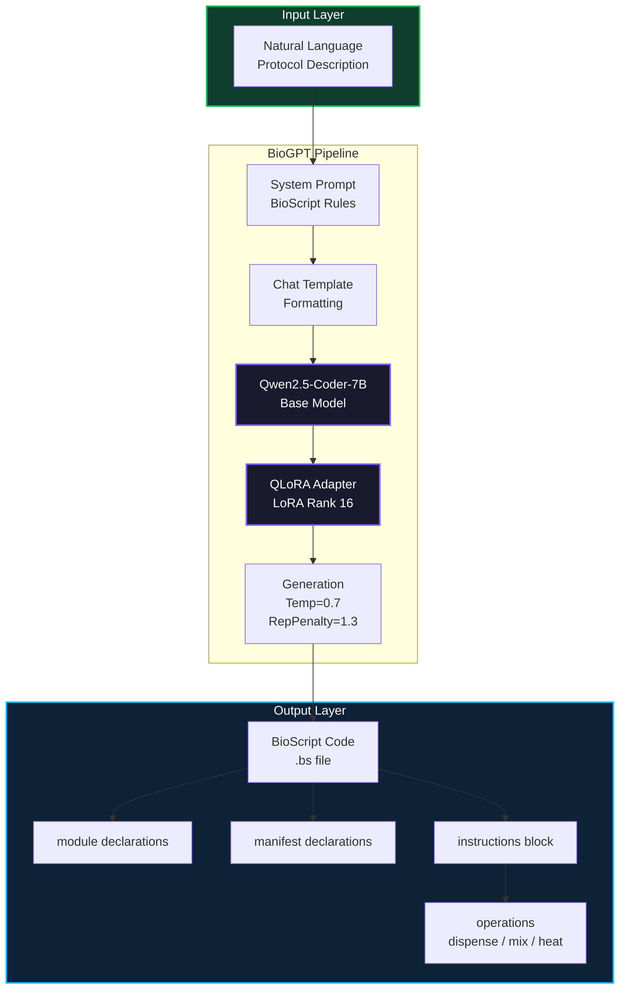
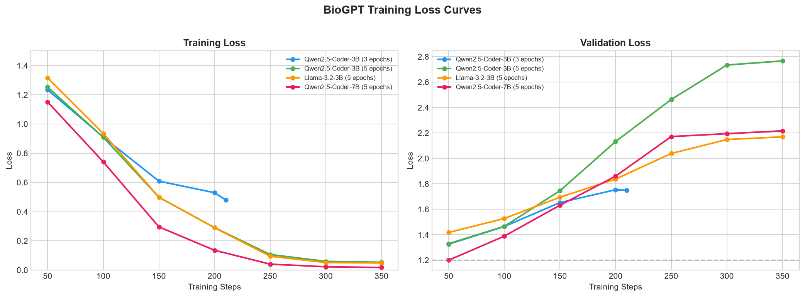
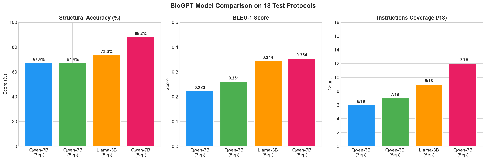
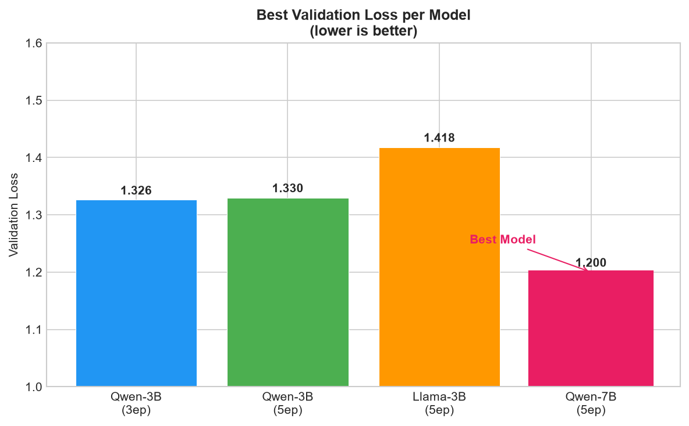
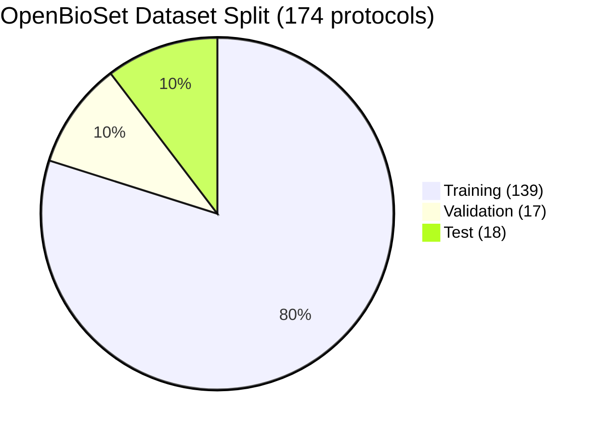
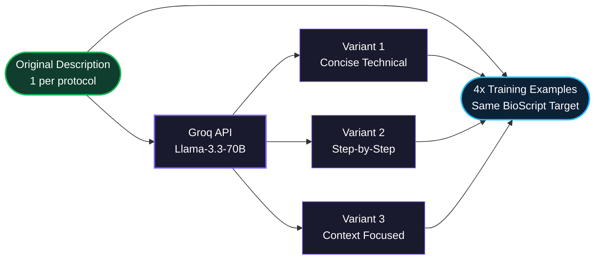
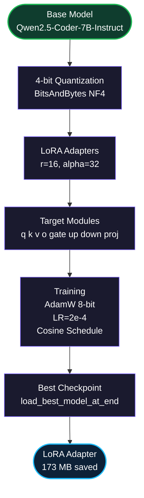

<div align="center">


<br/>

<a href="https://git.io/typing-svg">
  
</a>

<br/><br/>

[](https://python.org)
[](https://pytorch.org)
[](https://huggingface.co/hellokitty1212/biogpt-qwen7b-lora)
[](https://kaggle.com)
[](LICENSE)

<br/>

**Authors:** Sayan Mondal &nbsp;&middot;&nbsp; Sanju De &nbsp;&middot;&nbsp; Ishan Gain &nbsp;&nbsp;|&nbsp;&nbsp; **Institution:** Indian Institute of Technology, Roorkee &nbsp;&nbsp;|&nbsp;&nbsp; **Date:** August 2026

[](https://github.com/IshanGain)

<br/>

</div>


<div align="center">

<br/>

<table>
  <tr>
    <td align="center" width="200">
      <a href="#overview">
        
      </a>
    </td>
    <td align="center" width="200">
      <a href="#pipeline">
        
      </a>
    </td>
    <td align="center" width="200">
      <a href="#architecture">
        
      </a>
    </td>
  </tr>
  <tr>
    <td align="center" width="200">
      <a href="#results">
        
      </a>
    </td>
    <td align="center" width="200">
      <a href="#dataset-openbioscript">
        
      </a>
    </td>
    <td align="center" width="200">
      <a href="#data-augmentation">
        
      </a>
    </td>
  </tr>
  <tr>
    <td align="center" width="200">
      <a href="#fine-tuning-configuration">
        
      </a>
    </td>
    <td align="center" width="200">
      <a href="#repository-structure">
        
      </a>
    </td>
    <td align="center" width="200">
      <a href="#key-findings">
        
      </a>
    </td>
  </tr>
  <tr>
    <td align="center" width="200">
      <a href="#limitations">
        
      </a>
    </td>
    <td align="center" width="200">
      <a href="#future-work">
        
      </a>
    </td>
    <td align="center" width="200">
      <a href="#citation">
        
      </a>
    </td>
  </tr>
</table>

<br/>

</div>


## Overview

<div align="center">

[-1DB954?style=flat-square)]()
[-0d2137?style=flat-square)]()
[]()
[]()
[]()

</div>

<br/>

**BioGPT** is the first LLM-based pipeline for automatically generating **BioScript** (`.bs`) code from natural language descriptions of biological laboratory protocols.

BioScript is a domain-specific language (DSL) compiled by the [lilott8/BioScript](https://github.com/lilott8/BioScript) ANTLR4-based compiler for automating digital microfluidic (DMF) protocols. Writing BioScript manually requires deep expertise in both the biological domain and compiler syntax — a significant barrier for wet-lab scientists. BioGPT eliminates this barrier by fine-tuning large language models on a curated dataset of 174 real-world protocols.

> [!IMPORTANT]
> *"Can large language models learn to generate syntactically valid, structurally complete BioScript from plain-English protocol descriptions?"*


## Pipeline

<div align="center">

[]()
[]()
[]()
[]()

</div>




```mermaid
flowchart LR
    A([OpenBioSet\n174 Protocols]) --> B[Data Extraction\nStep 1]
    B --> C[Train / Val / Test\n139 / 17 / 18]
    C --> D[Data Augmentation\nGroq API\nStep 2]
    D --> E[553 Training\nExamples]
    E --> F[QLoRA Fine-tuning\nUnsloth + Kaggle T4x2\nStep 3]
    F --> G[4 Fine-tuned\nModels]
    G --> H[Evaluation\nStructural + BLEU\nStep 4]
    H --> I([Best Model\nQwen2.5-Coder-7B\n88.2% Structural])

    style A fill:#0f3d2e,color:#fff,stroke:#1DB954,stroke-width:2px
    style I fill:#0f3d2e,color:#fff,stroke:#1DB954,stroke-width:2px
    style F fill:#0d2137,color:#fff,stroke:#20BEFF,stroke-width:2px
    style H fill:#2a0a0a,color:#fff,stroke:#e74c3c,stroke-width:2px
    style B fill:#1a1a2e,color:#fff,stroke:#7B61FF,stroke-width:1px
    style C fill:#1a1a2e,color:#fff,stroke:#7B61FF,stroke-width:1px
    style D fill:#1a1a2e,color:#fff,stroke:#7B61FF,stroke-width:1px
    style E fill:#1a1a2e,color:#fff,stroke:#7B61FF,stroke-width:1px
    style G fill:#1a1a2e,color:#fff,stroke:#7B61FF,stroke-width:1px
```

## Architecture

<div align="center">

[]()
[]()
[]()
[]()
[]()

</div>




## Results

<div align="center">

[]()
[]()
[]()
[]()

</div>

<br/>

### Model Comparison on 18 Held-Out Test Protocols

<div align="center">

| Model | Parameters | Epochs | Struct% | BLEU-1 | Module | Manifest | Instructions | Dispense | Non-Rep |
|:------|:---------:|:------:|:-------:|:------:|:------:|:--------:|:------------:|:--------:|:-------:|
| Qwen2.5-Coder-3B | 3B | 3 | 67.4% | 0.223 | 14/18 | 10/18 | 6/18 | 10/18 | 18/18 |
| Qwen2.5-Coder-3B | 3B | 5 | 67.4% | 0.261 | 15/18 | 13/18 | 7/18 | 9/18 | 18/18 |
| Llama-3.2-3B | 3B | 5 | 73.6% | 0.344 | 14/18 | 9/18 | 9/18 | 12/18 | 18/18 |
| **Qwen2.5-Coder-7B** | **7B** | **5** | **88.2%** | **0.354** | **17/18** | **14/18** | **12/18** | **14/18** | **18/18** |

> **Best model:** Qwen2.5-Coder-7B-Instruct fine-tuned with QLoRA for 5 epochs.

</div>

<br/>

### Training Loss Summary

<div align="center">

| Model | Best Val Loss | Best Step | Final Train Loss |
|:------|:------------:|:---------:|:---------------:|
| Qwen2.5-Coder-3B (3ep) | 1.326 | 50 | 0.481 |
| Qwen2.5-Coder-3B (5ep) | 1.330 | 50 | 0.054 |
| Llama-3.2-3B (5ep) | 1.418 | 50 | 0.049 |
| **Qwen2.5-Coder-7B (5ep)** | **1.200** | **50** | **0.018** |

</div>

<br/>

### Training Curves

<table>
  <tr>
    <td align="center" width="50%">
      <b>Training and Validation Loss</b><br/><br/>
      
    </td>
    <td align="center" width="50%">
      <b>Model Comparison — Structural Accuracy & BLEU</b><br/><br/>
      
    </td>
  </tr>
  <tr>
    <td align="center" colspan="2">
      <b>Validation Loss Comparison Across All Models</b><br/><br/>
      
    </td>
  </tr>
</table>


## Dataset: OpenBioSet

<div align="center">

[]()
[]()
[]()
[]()

</div>

<br/>



<div align="center">

<table>
  <tr>
    <td align="center">
      <br/>
      <sub>553 after augmentation</sub>
    </td>
    <td align="center">
      <br/>
      <sub>No augmentation applied</sub>
    </td>
    <td align="center">
      <br/>
      <sub>No augmentation applied</sub>
    </td>
  </tr>
</table>

| Split | Original | After Augmentation |
|:-----:|:-------:|:-----------------:|
| Train | 139 | 553 (4x) |
| Val | 17 | 17 (no augmentation) |
| Test | 18 | 18 (no augmentation) |
| **Total** | **174** | **588** |

</div>

Each protocol folder contains:

```
protocol_name/
├── protocol_name.bs          # BioScript source code  (target output)
├── protocol_name.json        # Protocol metadata
├── description.txt           # Natural language description  (model input)
├── output.ir                 # Compiled intermediate representation
└── output.dot                # Control flow graph
```


## Data Augmentation

<div align="center">

[]()
[]()
[]()
[]()

</div>



<div align="center">

| Stat | Count |
|:-----|:-----:|
| Original training descriptions | 139 |
| Augmented variants (3 per description) | 417 |
| Total training examples | 556 |
| Coverage multiplier | 4x |

</div>

BioScript code remains **identical** for all variants — only the natural language input is diversified.


## Fine-tuning Configuration

<div align="center">

[]()
[]()
[]()
[]()
[]()
[]()

</div>



<div align="center">

| Hyperparameter | Value |
|:--------------|:-----:|
| LoRA Rank (r) | 16 |
| LoRA Alpha | 32 |
| LoRA Dropout | 0.05 |
| Learning Rate | 2e-4 |
| Batch Size (effective) | 8 (1 x 8 accumulation) |
| Epochs | 5 |
| LR Scheduler | Cosine |
| Warmup Ratio | 0.05 |
| Optimizer | adamw_8bit |
| Max Seq Length | 2048 |
| Quantization | 4-bit NF4 |
| GPU | Kaggle T4 x 2 |

</div>


## Repository Structure

```
BioGPT/
├── dataset/
│   ├── raw_extraction.json       # All 174 protocol records
│   ├── train_augmented.jsonl     # 553 training examples
│   ├── val.jsonl                 # 17 validation examples
│   └── test.jsonl                # 18 test examples
│
├── evaluation/
│   ├── comparison_summary.json   # Final comparison metrics
│   ├── Qwen2.5-Coder-3B-3ep_results.json
│   ├── Qwen2.5-Coder-3B-5ep_results.json
│   ├── Llama-3.2-3B-5ep_results.json
│   └── Qwen2.5-Coder-7B-5ep_results.json
│
├── models/
│   ├── qwen3b_3ep/lora_adapter/  # Qwen2.5-Coder-3B (3 epochs)
│   ├── qwen3b_5ep/lora_adapter/  # Qwen2.5-Coder-3B (5 epochs)
│   ├── llama3b_5ep/lora_adapter/ # Llama-3.2-3B (5 epochs)
│   └── qwen7b_5ep/lora_adapter/  # Qwen2.5-Coder-7B (5 epochs) [Best]
│                                    -> HuggingFace: hellokitty1212/biogpt-qwen7b-lora
│
├── notebooks/
│   └── biogpt.ipynb              # Complete training pipeline (Kaggle)
│
├── results/
│   ├── training_curves.png       # Training and validation loss curves
│   ├── model_comparison.png      # Structural accuracy, BLEU, coverage
│   └── validation_loss_comparison.png
│
├── src/
│   ├── __init__.py
│   ├── data_extraction.py        # Step 1: Extract protocols from OpenBioSet
│   ├── augmentation.py           # Step 2: Groq API paraphrasing
│   ├── training.py               # Step 3: QLoRA fine-tuning with Unsloth
│   ├── evaluation.py             # Step 4: Structural accuracy and BLEU
│   └── inference.py              # BioGPTInference class
│
├── generate_plots.py             # Generate result plots locally
├── .gitignore
├── README.md
└── requirements.txt
```


## Installation

```bash
git clone https://github.com/IshanGain/BioGPT
cd BioGPT
pip install -r requirements.txt
```

## Quick Inference

```python
from src.inference import BioGPTInference

biogpt = BioGPTInference(
    adapter_path = "./models/qwen7b_5ep/lora_adapter",
    hf_token     = "your_hf_token"
)

code = biogpt.generate(
    "PCR amplification protocol: Mix DNA template with primers "
    "and master mix, heat to 95C for denaturation, cycle through "
    "annealing at 60C and extension at 72C, detect by fluorescence."
)
print(code)
```

**Expected output:**

```
module pcr

manifest DNA_Template
manifest Primers
manifest PCR_MasterMix

instructions:

// Step 1: Prepare PCR reaction
dna  = dispense DNA_Template into $1 for 5s
pri  = dispense Primers into $2 for 5s
mmix = dispense PCR_MasterMix into $3 for 5s
rxn  = mix dna with pri for 10s
rxn  = mix rxn with mmix for 10s

// Step 2: PCR cycling
heat rxn at 95c for 5m
heat rxn at 60c for 30s
heat rxn at 72c for 1m

// Step 3: Detect amplification
result = detect fluorescence on rxn for 10s
```


## Key Findings

<div align="center">

[]()
[]()
[]()
[]()
[]()

</div>

<br/>

<div align="center">

| # | Finding |
|:-:|:--------|
| 1 | **Model size is the strongest predictor** — Qwen-7B outperforms all 3B models by a significant margin (88.2% vs 67.4% structural accuracy). |
| 2 | **Code specialization outperforms general instruction tuning** — Qwen models outperform Llama-3B despite comparable parameter counts, validating the use of code-specialized base models for DSL generation. |
| 3 | **Overfitting occurs after step 50** — All models achieve best validation loss at step 50 and overfit beyond that, confirming dataset size (553 examples) as the primary bottleneck. |
| 4 | **Epoch count has minimal impact on 3B models** — 3 vs 5 epochs produces identical structural accuracy (67.4%), further confirming dataset size limitations. |
| 5 | **Zero repetitive outputs across all models** — Repetition penalty (1.3) completely eliminates looping behavior (18/18 non-repetitive). |

</div>


## Limitations

<div align="center">

| Limitation | Detail |
|:-----------|:-------|
| Small dataset | 174 protocols limits generalization to unseen protocol types |
| No compiler validation | Structural accuracy is a proxy metric — compiler-based validation not yet integrated |
| Name divergence | Module and variable names differ from reference code (expected generative behavior) |
| Instructions coverage | Instructions section coverage ranges from 33% to 67% depending on model size |

</div>


## Future Work

<div align="center">

[]()
[]()
[]()

<br/><br/>

| Priority | Direction |
|:--------:|:----------|
|  | **Expand OpenBioSet** — grow coverage across more protocol types and biological domains |
|  | **Compiler-based evaluation** — integrate BioScript compiler for execution-based validation (compilation rate metric) |
|  | **Larger models** — explore 13B+ architectures with extended fine-tuning |
|  | **RLHF with compiler feedback** — use compilation success/failure as a reward signal |
|  | **Few-shot prompting** — improve naming consistency through in-context examples |
|  | **Multi-turn refinement** — iterative BioScript correction through dialogue |

</div>


## Citation

```bibtex
@misc{gain2026biogpt,
  title       = {BioGPT: LLM-Based BioScript Compiler Automation},
  author      = {Ishan Gain},
  year        = {2026},
  institution = {Indian Institute of Technology, Roorkee},
  url         = {https://github.com/IshanGain/BioGPT}
}
```

## License

MIT License — see [LICENSE](LICENSE) for details.


<div align="center">

[](https://github.com/IshanGain)
[](https://huggingface.co/hellokitty1212/biogpt-qwen7b-lora)
[](https://www.iitr.ac.in)

</div>
