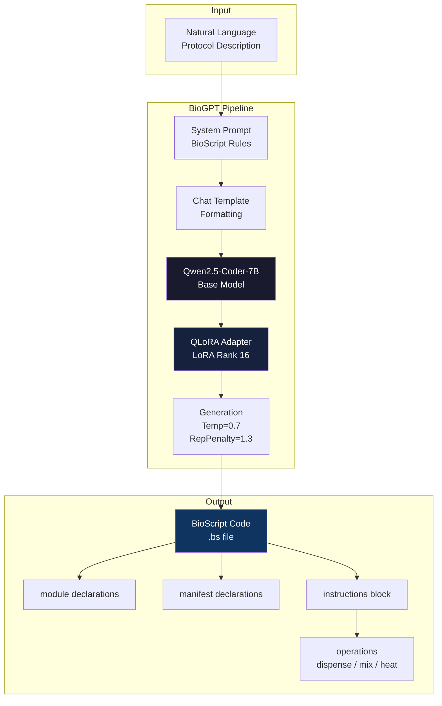
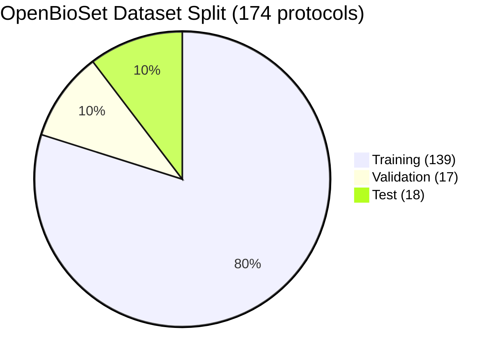
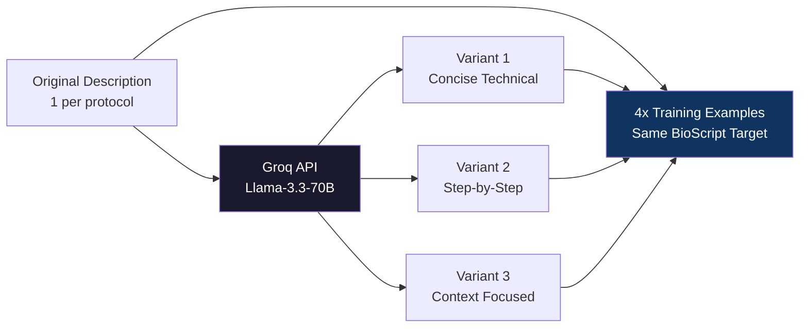
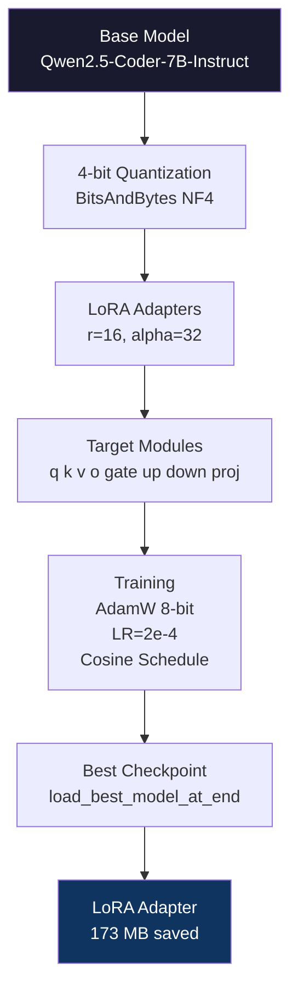

<div align="center">

# BioGPT: LLM-Based BioScript Compiler Automation

[](https://python.org)
[](https://pytorch.org)
[](https://huggingface.co/hellokitty1212/biogpt-qwen7b-lora)
[](https://kaggle.com)
[](LICENSE)

**Authors:** Sayan Mondal &nbsp;·&nbsp; Sanju De &nbsp;·&nbsp; Ishan Gain &nbsp;|&nbsp; **Institution:** Indian Institute of Technology, Roorkee &nbsp;|&nbsp; **Date:** August 2026

**Pipeline Architecture & Implementation:** Ishan Gain

</div>

---

## Table of Contents

- [Overview](#overview)
- [Pipeline](#pipeline)
- [Architecture](#architecture)
- [Results](#results)
  - [Model Comparison](#model-comparison-on-18-held-out-test-protocols)
  - [Training Loss Summary](#training-loss-summary)
  - [Training Curves](#training-curves)
- [Dataset: OpenBioSet](#dataset-openbioscript)
- [Data Augmentation](#data-augmentation)
- [Fine-tuning Configuration](#fine-tuning-configuration)
- [Repository Structure](#repository-structure)
- [Installation](#installation)
- [Quick Inference](#quick-inference)
- [Key Findings](#key-findings)
- [Limitations](#limitations)
- [Future Work](#future-work)
- [Citation](#citation)
- [License](#license)

---

## Overview

**BioGPT** is the first LLM-based pipeline for automatically generating **BioScript** (`.bs`) code from natural language descriptions of biological laboratory protocols.

BioScript is a domain-specific language (DSL) compiled by the [lilott8/BioScript](https://github.com/lilott8/BioScript) ANTLR4-based compiler for automating digital microfluidic (DMF) protocols. Writing BioScript manually requires deep expertise in both the biological domain and compiler syntax — a significant barrier for wet-lab scientists. BioGPT eliminates this barrier by fine-tuning large language models on a curated dataset of 174 real-world protocols.

---

## Pipeline


---

## Architecture



---

## Results

### Model Comparison on 18 Held-Out Test Protocols

| Model | Parameters | Epochs | Struct% | BLEU-1 | Module | Manifest | Instructions | Dispense | Non-Rep |
|-------|-----------|--------|---------|--------|--------|----------|--------------|----------|---------|
| Qwen2.5-Coder-3B | 3B | 3 | 67.4% | 0.223 | 14/18 | 10/18 | 6/18 | 10/18 | 18/18 |
| Qwen2.5-Coder-3B | 3B | 5 | 67.4% | 0.261 | 15/18 | 13/18 | 7/18 | 9/18 | 18/18 |
| Llama-3.2-3B | 3B | 5 | 73.6% | 0.344 | 14/18 | 9/18 | 9/18 | 12/18 | 18/18 |
| **Qwen2.5-Coder-7B** | **7B** | **5** | **88.2%** | **0.354** | **17/18** | **14/18** | **12/18** | **14/18** | **18/18** |

> **Best model:** Qwen2.5-Coder-7B-Instruct fine-tuned with QLoRA for 5 epochs.

### Training Loss Summary

| Model | Best Val Loss | Best Step | Final Train Loss |
|-------|--------------|-----------|-----------------|
| Qwen2.5-Coder-3B (3ep) | 1.326 | 50 | 0.481 |
| Qwen2.5-Coder-3B (5ep) | 1.330 | 50 | 0.054 |
| Llama-3.2-3B (5ep) | 1.418 | 50 | 0.049 |
| **Qwen2.5-Coder-7B (5ep)** | **1.200** | **50** | **0.018** |

### Training Curves


### Model Comparison


### Validation Loss Comparison


---

## Dataset: OpenBioSet



| Split | Original | After Augmentation |
|-------|---------|-------------------|
| Train | 139 | 553 (4x) |
| Val | 17 | 17 (no augmentation) |
| Test | 18 | 18 (no augmentation) |
| **Total** | **174** | **588** |

Each protocol folder contains:

```
protocol_name/
├── protocol_name.bs          # BioScript source code  (target output)
├── protocol_name.json        # Protocol metadata
├── description.txt           # Natural language description  (model input)
├── output.ir                 # Compiled intermediate representation
└── output.dot                # Control flow graph
```

---

## Data Augmentation



| Stat | Count |
|------|-------|
| Original training descriptions | 139 |
| Augmented variants (3 per description) | 417 |
| Total training examples | 556 |
| Coverage multiplier | 4× |

BioScript code remains **identical** for all variants — only the natural language input is diversified.

---

## Fine-tuning Configuration



| Hyperparameter | Value |
|----------------|-------|
| LoRA Rank (r) | 16 |
| LoRA Alpha | 32 |
| LoRA Dropout | 0.05 |
| Learning Rate | 2e-4 |
| Batch Size (effective) | 8 (1 × 8 accumulation) |
| Epochs | 5 |
| LR Scheduler | Cosine |
| Warmup Ratio | 0.05 |
| Optimizer | adamw_8bit |
| Max Seq Length | 2048 |
| Quantization | 4-bit NF4 |
| GPU | Kaggle T4 × 2 |

---

## Repository Structure

```
BioGPT/
├── dataset/
│   ├── raw_extraction.json       # All 174 protocol records
│   ├── train_augmented.jsonl     # 553 training examples
│   ├── val.jsonl                 # 17 validation examples
│   └── test.jsonl                # 18 test examples
│
├── evaluation/
│   ├── comparison_summary.json   # Final comparison metrics
│   ├── Qwen2.5-Coder-3B-3ep_results.json
│   ├── Qwen2.5-Coder-3B-5ep_results.json
│   ├── Llama-3.2-3B-5ep_results.json
│   └── Qwen2.5-Coder-7B-5ep_results.json
│
├── models/
│   ├── qwen3b_3ep/lora_adapter/  # Qwen2.5-Coder-3B (3 epochs)
│   ├── qwen3b_5ep/lora_adapter/  # Qwen2.5-Coder-3B (5 epochs)
│   ├── llama3b_5ep/lora_adapter/ # Llama-3.2-3B (5 epochs)
│   └── qwen7b_5ep/lora_adapter/  # Qwen2.5-Coder-7B (5 epochs) [Best]
│                                    -> HuggingFace: hellokitty1212/biogpt-qwen7b-lora
│
├── notebooks/
│   └── biogpt.ipynb              # Complete training pipeline (Kaggle)
│
├── results/
│   ├── training_curves.png       # Training and validation loss curves
│   ├── model_comparison.png      # Structural accuracy, BLEU, coverage
│   └── validation_loss_comparison.png
│
├── src/
│   ├── __init__.py
│   ├── data_extraction.py        # Step 1: Extract protocols from OpenBioSet
│   ├── augmentation.py           # Step 2: Groq API paraphrasing
│   ├── training.py               # Step 3: QLoRA fine-tuning with Unsloth
│   ├── evaluation.py             # Step 4: Structural accuracy and BLEU
│   └── inference.py              # BioGPTInference class
│
├── generate_plots.py             # Generate result plots locally
├── .gitignore
├── README.md
└── requirements.txt
```

---

## Installation

```bash
git clone https://github.com/IshanGain/BioGPT
cd BioGPT
pip install -r requirements.txt
```

---

## Quick Inference

```python
from src.inference import BioGPTInference

biogpt = BioGPTInference(
    adapter_path = "./models/qwen7b_5ep/lora_adapter",
    hf_token     = "your_hf_token"
)

code = biogpt.generate(
    "PCR amplification protocol: Mix DNA template with primers "
    "and master mix, heat to 95C for denaturation, cycle through "
    "annealing at 60C and extension at 72C, detect by fluorescence."
)
print(code)
```

**Expected output:**

```
module pcr

manifest DNA_Template
manifest Primers
manifest PCR_MasterMix

instructions:

// Step 1: Prepare PCR reaction
dna  = dispense DNA_Template into $1 for 5s
pri  = dispense Primers into $2 for 5s
mmix = dispense PCR_MasterMix into $3 for 5s
rxn  = mix dna with pri for 10s
rxn  = mix rxn with mmix for 10s

// Step 2: PCR cycling
heat rxn at 95c for 5m
heat rxn at 60c for 30s
heat rxn at 72c for 1m

// Step 3: Detect amplification
result = detect fluorescence on rxn for 10s
```

---

## Key Findings

1. **Model size is the strongest predictor** — Qwen-7B outperforms all 3B models by a significant margin (88.2% vs 67.4% structural accuracy).
2. **Code specialization outperforms general instruction tuning** — Qwen models outperform Llama-3B despite comparable parameter counts, validating the use of code-specialized base models for DSL generation.
3. **Overfitting occurs after step 50** — All models achieve best validation loss at step 50 and overfit beyond that, confirming dataset size (553 examples) as the primary bottleneck.
4. **Epoch count has minimal impact on 3B models** — 3 vs 5 epochs produces identical structural accuracy (67.4%), further confirming dataset size limitations.
5. **Zero repetitive outputs across all models** — Repetition penalty (1.3) completely eliminates looping behavior (18/18 non-repetitive).

---

## Limitations

- Small dataset (174 protocols) limits generalization to unseen protocol types.
- Compiler-based validation not yet integrated — structural accuracy is a proxy metric.
- Module and variable names differ from reference code (expected generative behavior).
- Instructions section coverage ranges from 33% to 67% depending on model size.

---

## Future Work

- Expand OpenBioSet with more protocol types and domains.
- Integrate BioScript compiler for execution-based evaluation (compilation rate metric).
- Explore larger models (13B+) with extended fine-tuning.
- Implement RLHF using compiler feedback as a reward signal.
- Add few-shot prompting for improved naming consistency.
- Multi-turn refinement for iterative BioScript correction.

---

## Citation

```bibtex
@misc{gain2026biogpt,
  title       = {BioGPT: LLM-Based BioScript Compiler Automation},
  author      = {Ishan Gain},
  year        = {2026},
  institution = {Indian Institute of Technology, Roorkee},
  url         = {https://github.com/IshanGain/BioGPT}
}
```

---

## License

MIT License — see [LICENSE](LICENSE) for details.

---

<div align="center">

Indian Institute of Technology, Roorkee &nbsp;|&nbsp; August 2026

</div>
